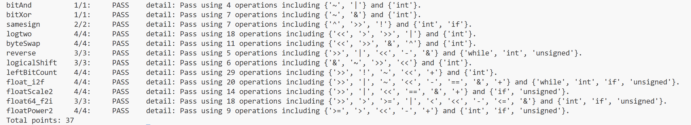

# datalab 报告

姓名：孙健航

学号：2025201711

| 项目 | bitAnd | bitXor | samesign | logtwo | byteSwap | reverse |
| :----: | :----: | :----: | :----: | :----: | :----: | :----: |
| 得分 / 满分 | 1/1 | 1/1 | 2/2 | 4/4 | 4/4 | 3/3 |

| 项目 | logicalShift | leftBitCount | float_i2f | floatScale2 | float64_f2i | floatPower2 | **总分** |
| :----: | :----: | :----: | :----: | :----: | :----: | :----: | :----: |
| 得分 / 满分 | 3/3 | 4/4 | 4/4 | 4/4 | 3/3 | 4/4 | **37/37** |

test 截图：



## 解题报告

### 亮点

1. **leftBitCount** —— 把「数前导 1」转成「数前导 0」，再用纯左移二分逼近，29 个算子（上限 50）
2. **float_i2f** —— 手写 round-half-to-even 舍入并处理尾数进位，20 个算子（上限 30）
3. **logtwo** —— 与 bitCount 同构、但方向相反的加权二分，18 个算子（上限 25）
4. **byteSwap** —— 先求两字节异或，再把它异或回两个位置，11 个算子（上限 17）

### leftBitCount

前导 1 的个数，等于 `y = ~x` 的前导 0 的个数。问题于是变成「数 y 开头有多少个 0」，用二分法逐段确认：

```c
y = ~x;
b16 = !(y >> 16);  y <<= b16 << 4;   /* 高 16 位全 0？→ 确认 16 个 */
b8  = !(y >> 24);  y <<= b8  << 3;   /* 再确认 8 个 */
b4  = !(y >> 28);  y <<= b4  << 2;
b2  = !(y >> 30);  y <<= b2  << 1;
b1  = !(y >> 31);
return (b16<<4)+(b8<<3)+(b4<<2)+(b2<<1)+b1 + !y;
```

- 每确认一段就把 `y` 左移掉，已经被数过的位永远不会再影响后面的判断，所以后续比较可以固定写成 `y >> 24`、`y >> 28`，不需要另外构造掩码。
- 最后单独加一个 `!y` 处理全 1 边界：`x = -1` 时 `y = 0`，五个 `b` 加起来只有 31，补上 `!y = 1` 才是 32。

### float_i2f

按 IEEE-754 的字段逐段拼出来：

1. `sign = ux & 0x80000000`，`x == 0` 直接返回 0；负数用 `~ux + 1u` 取绝对值（这样不必依赖 `-`）。
2. **规格化**：把 `mag` 不断左移，直到最高位 (bit 31) 为 1；指数计数器从 `158` 开始每移一次减一。
   为什么是 158：规格化后最高位的 1 落在 bit 31，即此时数值是 `1.xxx × 2^31`；而共左移了 `s` 次，所以 `x = mag × 2^(-s)`，无偏指数为 `31 - s`，加上偏置得 `158 - s`。
3. `frac = (mag >> 8) & 0x7fffff`：bit 31 是隐含的 1，右移 8 位并掩掉最高位后，剩下的正好是 23 位小数部分。

```c
if (mag & 0x80u)                     /* 被丢弃的第一位不是 0 */
    if ((mag & 0x7fu) | (frac & 1u)) {   /* 后面还有 1（进），或恰好是半数且末位为 1（到偶数） */
        frac = frac + 1;
        if (frac >> 23) { frac = 0; exp = exp + 1; }   /* 进位溢出到指数 */
    }
return sign | (exp << 23) | frac;
```

第 3 步的舍入是本题最容易出错的地方：按 IEEE-754 默认的 **round half to even**，只有「保护位为 1，且（粘滞位非 0，或保留位末位为 1）」时才进位；否则直接截断。进位的极端情况是 `frac` 从 `0x7fffff` 加回 `0`，此时必须让指数加一。

### logtwo

`v > 0`，所以问题就是「最高的那个 1 在哪一位」。题目注释里提示参考 `bitCount`，实际思路也一样——用 16/8/4/2/1 的加权二分逼近，只是这里把「加的位数」换成了「移的位数」：

```c
shift = (v > 0xFFFF) << 4;  v >>= shift;  res |= shift;
shift = (v > 0xFF)   << 3;  v >>= shift;  res |= shift;
shift = (v > 0xF)    << 2;  v >>= shift;  res |= shift;
shift = (v > 0x3)    << 1;  v >>= shift;  res |= shift;
shift = v > 0x1;            res |= shift;
```

每次先问「最高位是否还在下面 16/8/4/2/1 位之内」，是就把 `v` 往下移、并把这一段权重记进 `res`。贪心地从高位到低位确定，5 步 (16+8+4+2+1 = 31) 恰好覆盖 1～31 的全部可能值。

### byteSwap

常见写法是把两个字节各自掩码取出、移位、再或回去。这里少走一步：两个字节的**异或值** `d` 在两个位置上都是「需要翻转的位」，所以把 `d` 分别在两个位置异或一次，就完成交换，其余字节不受影响。

```c
int d = ((x >> (n<<3)) & 0xFF) ^ ((x >> (m<<3)) & 0xFF);
return x ^ (d << (n<<3)) ^ (d << (m<<3));
```

顺带的好处是 `n == m` 时 `d == 0`，自动退化成原值，不需要特判。

### bitXor

要求只用 `~` 和 `&`。已知 `x ^ y = (x | y) & ~(x & y)`，而 `x | y` 可以用德摩根律化成 `~(~x & ~y)`，于是

```c
return ~(x&y) & ~(~x&~y);
```

正好 7 个算子，踩在上限上。

### samesign

`x >> 31` 是算术右移，非负得 `0`、负数得 `-1`（全 1），两者异或为 `0` 就说明同号，再用 `!` 归一成 `0/1`。难点是题目规定 **0 既不正也不负**，需要单独处理：

```c
if (!x) return !y;          /* (0,0)→1，(0,其他)→0 */
else if (!y) return 0;      /* (负/正, 0)→0 */
return !((x >> 31) ^ (y >> 31));
```

### reverse

题目在这一题额外放开了 `while` 和 `unsigned`，所以直接用循环逐位搬运最省事：结果左移一位、把 `v` 的最低位贴上去，`v` 右移一位，共 32 轮。

```c
while (count) { result = (result << 1) | (v & 1u); v >>= 1; count = count - 1; }
```

用 `unsigned` 保证 `v >> 1` 是逻辑右移（不会把符号位补进来），静态算子数只有 5 个。

### logicalShift

`x >> n` 是算术右移，会在高位补进 `n` 个符号位，所以要造一个「高 `n` 位为 0、其余为 1」的掩码把它们清掉：

```c
int mask = ~(((1 << 31) >> n) << 1);
return (x >> n) & mask;
```

`(1 << 31) >> n` 是算术右移，得到高 `n+1` 位全 1；再左移一位去掉最下面那一位，取反后就是低 `32-n` 位全 1。`n = 0` 时中间结果 `0x80000000 << 1` 恰好为 `0`，掩码变成全 1，刚好等价于不清理——这个边界不需要额外分支。

### floatScale2

按指数分三种情况：

- `exp == 0xFF`：无穷或 NaN，题目要求 NaN 原样返回，所以直接 `return uf`。
- `exp == 0`：零或非规格化数。乘以 2 只是把小数部分左移一位；如果进位到了 bit 23（`0x800000`），说明它升格成了规格化数，令 `exp = 1` 并把这一位清掉。`±0` 移完仍是 `±0`，符号位是最后统一或回去的，所以负零不会变成正零。
- 其余：`exp + 1`；若加完等于 `0xFF`，说明已经变成正负无穷，必须把 `frac` 清零，否则会得到 Inf 但带上尾数。

### float64_f2i

64 位浮点的高 32 位（`uf2`）含符号 1 位 + 阶码 11 位 + 小数高 20 位，低 32 位（`uf1`）是小数低 32 位。流程：

1. `exp > 0x7FE`（Inf/NaN）→ 溢出，返回 `0x80000000`。
2. `exp < 1023`，即 `|x| < 1` → 向零取整为 `0`。
3. `e = exp - 1023`；`e >= 31` → 超过 `int` 范围，返回 `0x80000000`。
4. 重组有效数字 `sig = 0x100000 | frac_hi`（隐含 1 加 20 位，共 21 位）。
5. `e <= 20` 时整数部分完全在 `sig` 里，右移 `20 - e` 位即完成截断；否则先左移 `e - 20` 位，再从 `uf1` 的高位取 `uf1 >> (52 - e)` 补上低位。**必须用 `|` 而不是 `+` 拼接**，因为左移后低 `e-20` 位是 0，两者不重叠。
6. `if (sign) return 0 - signed_mag;` 补符号（`-` 在本题合法）。

全程只做截断、不做舍入，符合「round towards zero」。

### floatPower2

按 `x` 落在哪一段分三种输出：

```c
if (x > 127)   return 0x7f800000u;          /* 超出最大规格化数 → +Inf */
if (x >= -126) return (x + 127) << 23;      /* 规格化：阶码 = x + 127 */
if (x >= -149) return 1u << (x + 149);      /* 非规格化：2^x = 1 × 2^(x+149) */
return 0;                                   /* 小于最小非规格化数 2^-149 */
```

非规格化段的两端值得核一下：`x = -127` 得 `1 << 22`，是最小的非规格化数 `2^-127`；`x = -149` 得 `1`，正是 `2^-149`；`x = -150` 才是 0。

### bitAnd

给的示例：`~(~x|~y)`，即德摩根律把「或」还原成「与非」。

## 反馈/收获/感悟/总结

这次实验让我第一次认真把整数的位表示和 IEEE-754 的字段布局从头推了一遍，收获集中在两点。

一是**「先想再写」比「先写再试」划算得多**。像 `leftBitCount`、`logtwo` 这种二分式的题目，如果不去想「每确认一段就把已确认的位移走」这个不变量，很容易写成靠特判堆出来的版本，算子数也压不住。推导清楚之后代码反而是最短的。

二是**边界比正路难**。`float_i2f` 里舍入进位溢回指数、`floatScale2` 里非规格化升格和最大值变无穷、`samesign` 里 0 既不正也不负，这些地方都只有在边界上才会暴露。我后来专门用一组边界值（`INT_MIN`、`±0`、最小非规格化数、最大规格化数、`n = 0`、`n = 31`）逐条对过才放心。

题目本身难度分布比较合理，`-Wall` 零警告和禁止 UB 的约束也逼着我们写得干净一些。唯一觉得别扭的是 `samesign` 放开了 `if/else` 却又限制在 12 个算子内，写法上有点两难。

## 参考的重要资料

- Bryant, R. E., & O'Hallaron, D. R. **《深入理解计算机系统》(Computer Systems: A Programmer's Perspective, 3rd ed.)** 第 2 章「信息的表示和处理」——整数补码、位运算恒等式、IEEE-754 浮点格式与舍入规则
- 本实验模板仓库与 `README.md`：https://github.com/RUCICS/Datalab-2025Fall
